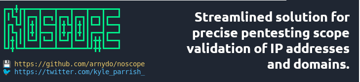

# NOSCOPE



The primary goal of NOSCOPE is to simplify the scoping process for security assessments. By allowing users to specify domains and/or IPs to be checked against a list of in-scope IPs and CIDRs, NOSCOPE helps ensure that the assessment focuses on the intended targets, thereby maximizing efficiency and accuracy.

## Usage

To use NOSCOPE, simply provide the tool with the domains and/or IPs you want to scope, along with a file containing the list of in-scope IPs and CIDRs. NOSCOPE will then compare the provided targets against the specified scope and output the results.

## Examples

Here are a few examples of how to use NOSCOPE:

```bash
# Scope domains against a list of in-scope IPs and CIDRs
python noscope.py --domain example.com subdomain.example.com --scope-file scope.txt

# Scope IPs against a list of in-scope IPs and CIDRs
python noscope.py --ip 192.168.0.1 10.0.0.1 --scope-file scope.txt
```

## Changelog

- **v1.0**: Initial release of NOSCOPE.

## Contribution

Contributions to NOSCOPE are welcome! If you encounter any issues, have ideas for new features, or want to contribute code improvements, please feel free to open an issue or submit a pull request on GitHub.

## License

NOSCOPE is licensed under the GPL License. See the [LICENSE](LICENSE) file for details.

## Contact

For questions, feedback, or suggestions, you can reach out to the project maintainer at [github@arnydo.com](mailto:github@arnydo.com). We'd love to hear from you!